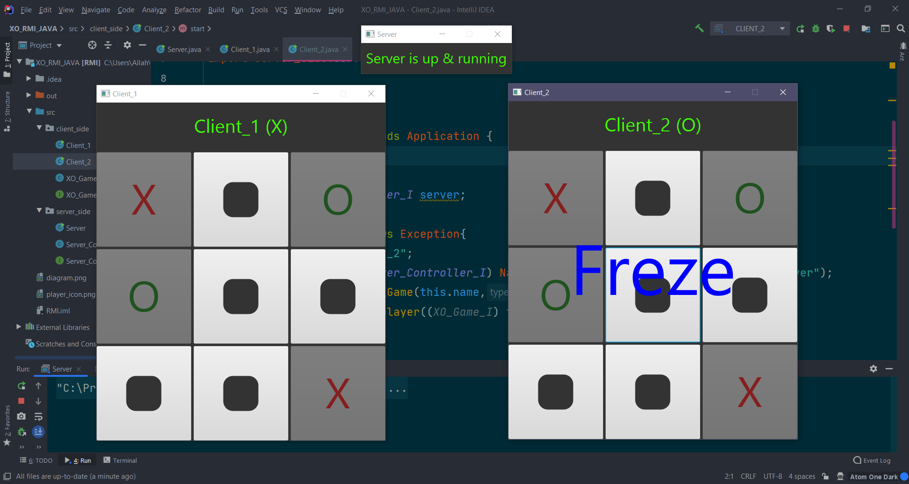
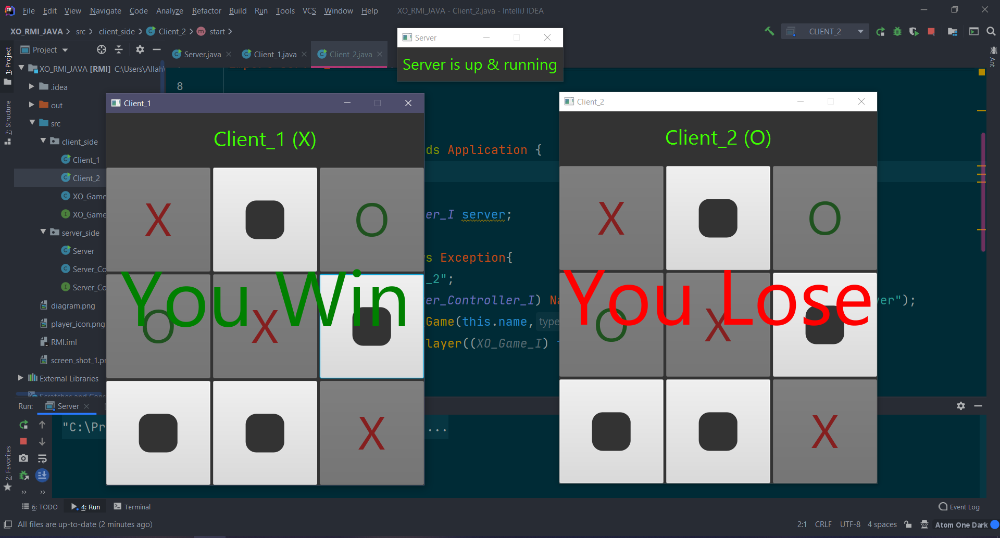

<h1>Project Diagram</h1>

<h1>Execution Steps</h1>
<h3>1) Run src/server_side/Server.java</h3>
<h3>2) Run src/client_side/Client_1.java</h3>
<h3>3) Run src/client_side/Client_2.java</h3>
<h1>Screen Shots 📷</h1>

 
